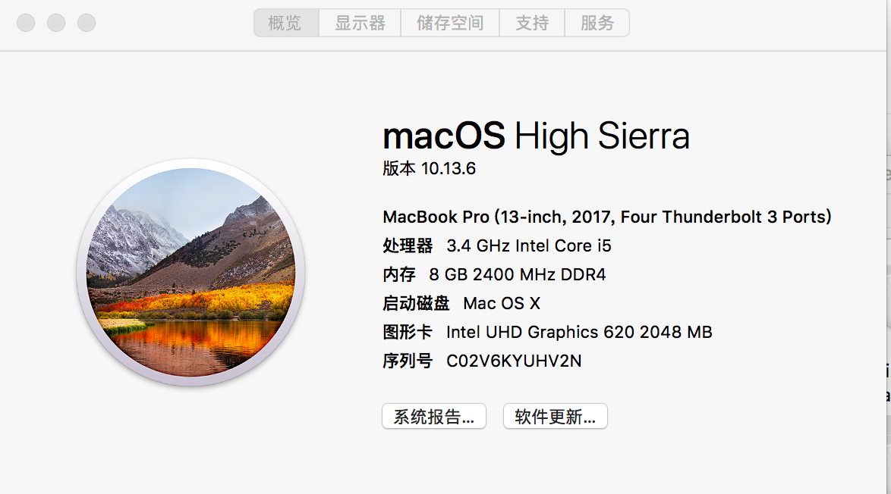
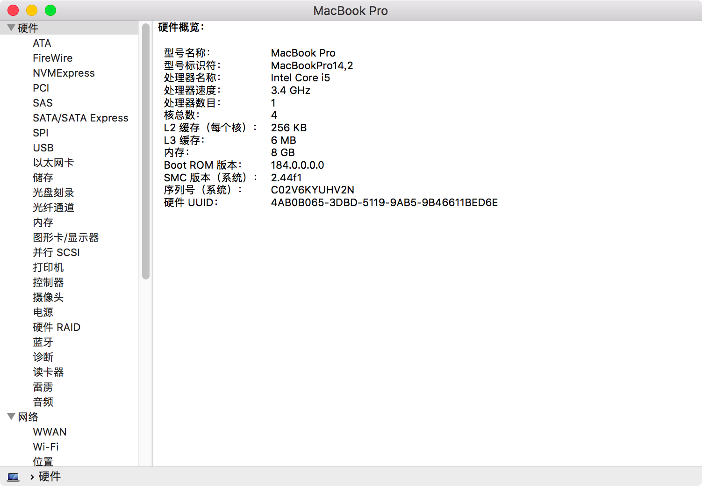
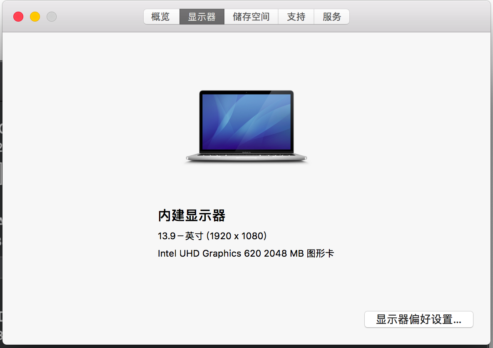
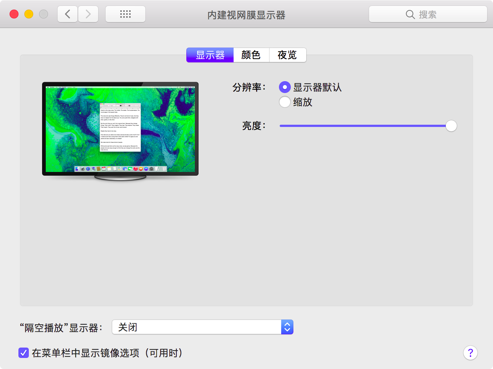
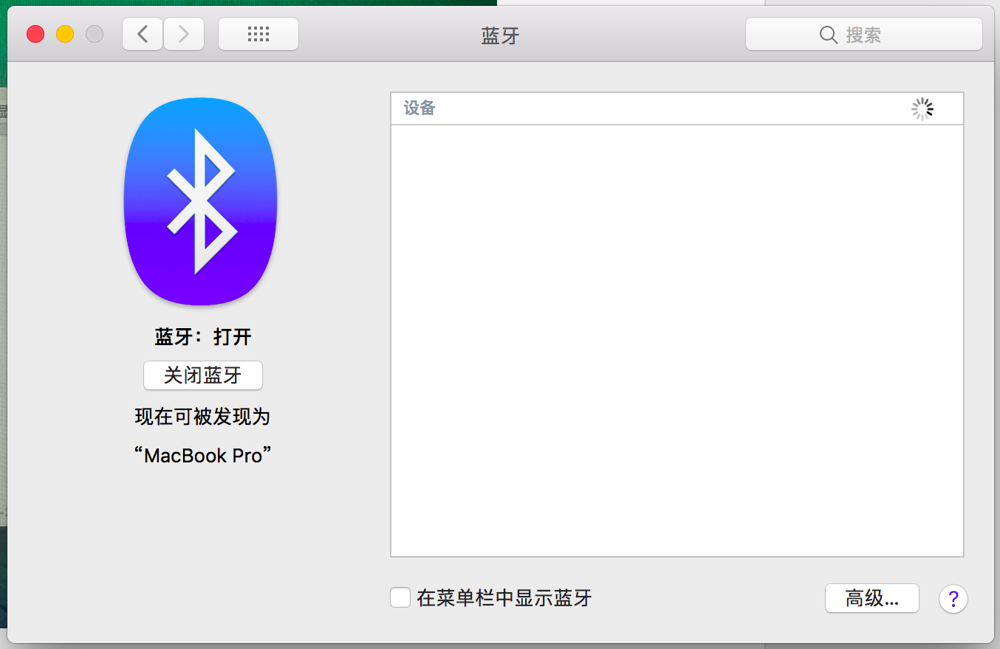
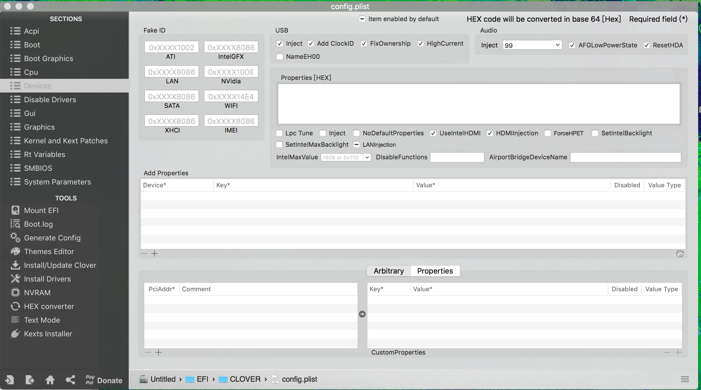
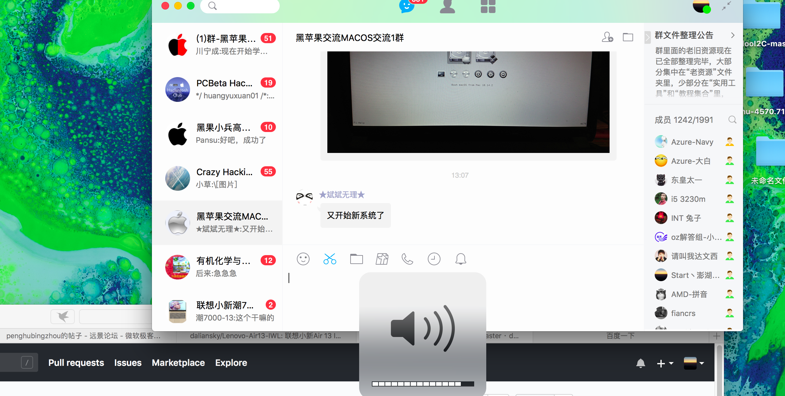
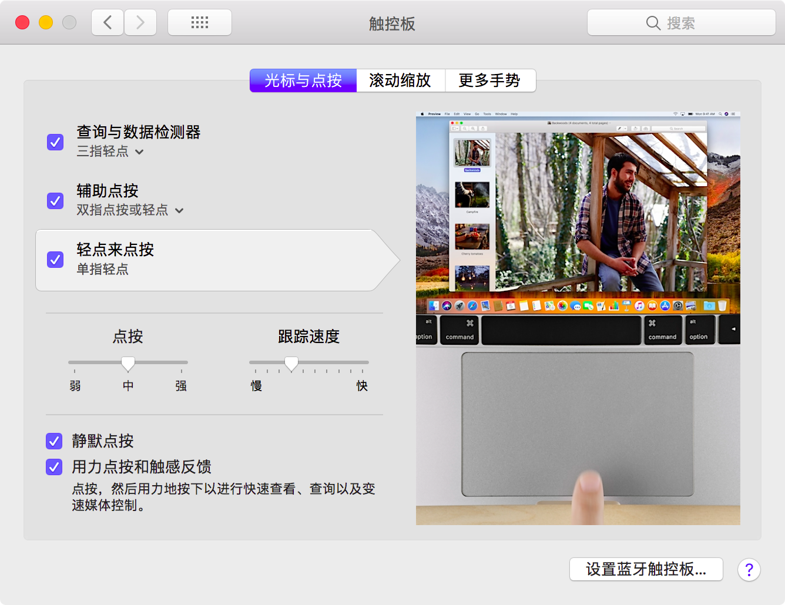
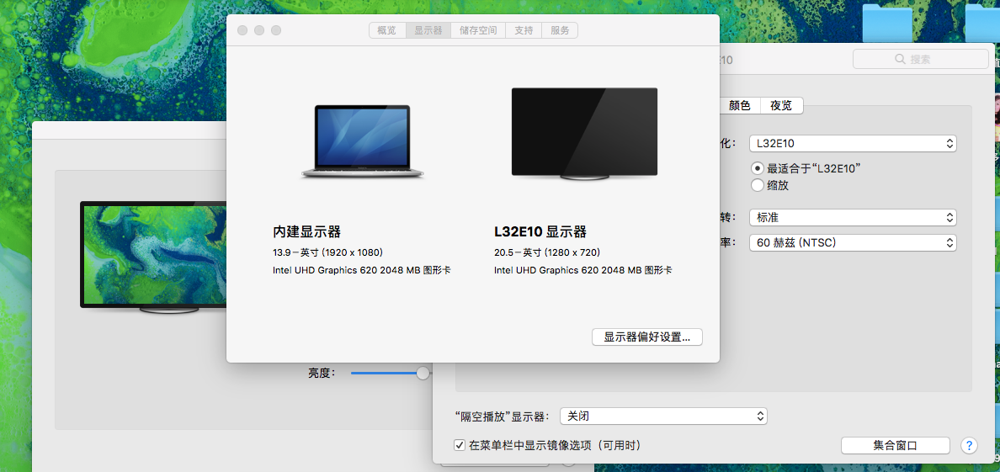

# 联想小新潮7000 EFI 黑苹果

[中文版](https://github.com/penghubingzhou/Lenovo-Xiaoxin-Chao-7000--EFI/blob/master/Readme.md)|[English](https://github.com/penghubingzhou/Lenovo-Xiaoxin-Chao-7000--EFI/blob/master/docs/Readme.md)

本EFI适配于联想小新潮7000 14寸系列的黑苹果。

## 电脑配置

| 规格     | 详细信息                                                |
| -------- | ------------------------------------------------------- |
| 电脑型号 | 联想Lenovo 小新潮7000                                   |
| 主板型号 | 81BM                                                    |
| 处理器   | Intel(R) Core(TM) i5-8250U CPU @ 1.80GHz                |
| 内存     | 8 GB  2400MHz                                           |
| 硬盘     | SAMSUNG MZVLW128HEGR-000L2 128GB+ST1000LM035-1RK172 1TB |
| 显卡     | Intel UHD Graphics 620/NVIDIA Graphic 940 MX            |
| 声卡     | ALC236                                                  |

## 完成情况

1. 显卡：由于机型BIOS限制，自带独显940MX无解，已经通过热补丁屏蔽；核显UHD620在13.6以上原生支持，已经使用`WhateverGreen`驱动，配置文件已经打入缓冲帧；HDMI输出目前存在问题
2. 网卡：英特尔无线网卡目前无解，更换为DW1560，驱动方式请见黑果小兵的帖子：[Broadcom WiFi/BlueTooth BCM94352z(DW1560)的正确驱动姿势[原始方法]](http://blog.daliansky.net/Broadcom-WiFi-BlueTooth-BCM94352z-DW1560-the%20correct-drive-posture.html)
3. 声卡：声卡型号为`ALC236`，使用`AppleALC`驱动声卡。ID列表中`3，11，13，15，16，99`均有输出，但是只有`15，99`相对完美。本EFI采用`99`
4. 蓝牙：自带英特尔蓝牙无解，更换为DW1560 的蓝牙可用，一切正常。
5. 电池：使用`VirtualSMC`以及其附属插件驱动，显示信息正常。
6. 触摸板：使用`VoodooI2C`驱动，多手势全功能正常工作；目前拖动必须设置为三指拖动，单指拖动无法工作。
7. 显示器：亮度调节正常，调节快捷键同Win，为`F11`和`F12`；HIDPI可用（开启方式请看[这里](https://github.com/xzhih/one-key-hidpi)）
8. USB端口识别，使用了热补丁进行端口定制，TypeC可用；添加了虚拟内建网卡，USB网卡也可用内置应用
9. 摄像头：14寸系列使用的摄像头有两个系列：凌扬(SunplusIT)系列目前存在无解瑕疵，开启FaceTime黑屏，必须使用Photo Booth唤醒摄像头才能打开；另一系列的完美
10. 读卡器：目前无解

## 必要说明

- 目前14寸有一系列所使用的DSDT与本EFI不一致，具体表现为电池信息不识别，触摸板ID为SYNA2393，此机型不能使用本EFI，需要等待下一版本的适配
- 目前本EFI尚未支持13寸，13寸的支持将在下一个大版本来临
- 由于更新需要，从3.2版本起，将不再提供12系列的配置文件适配

## 系统截图

## 最近更新

- 01-23-2019  EFI 3.2
  - 修复HDMI输出问题
  - 移除旧版VoodooSDHC驱动，添加Sinetek-rtsk驱动
  - 移除12系列的配置文件
  - 更新四叶草版本至4895，支持14.3安装使用
- 12-18-2018  EFI 3.1
  - 更新Lilu、 WhateverGreen版本
  - 更新四叶草版本为4798，支持14.1、14.2的安装与使用
  - 使用了全新的黑暗Mojave主题
  - 更新VoodooI2C，修复长时间使用死机问题
  - 移除变频SSDT，采用`PluginType`参数变频，
  - 添加虚拟内建网卡
- 10-31-2018  EFI 3.0

  - 使用CPUfriend添加了CPU变频
  - 添加VoodooSDHC驱动SD读卡器
  - 使用AppleALC驱动声卡
- 10-06-2018  EFI 2.1

  - 更新四叶草版本到4694，更换新主题
  - 添加了自动开启HIDPI的脚本`
  - 驱动合并整合
  - 更新驱动，去掉Shiki驱动

  - 添加了自动开启HIDPI的脚本

## EFI下载链接：

EFI全版本下载地址：[点击这里下载](https://pan.baidu.com/s/1QcrvxI5a68eUH37RmNd-Fg#list/path=%2F)

## 安装

镜像可以选择黑果小兵的镜像安装（下载地址见[黑果小兵部落阁](https://blog.daliansky.net))，也可以选择黑苹果乐园等其他来源。当然，如果你动手能力极强，也可以选择自己制作。安装方式推荐采用硬盘安装。详情请见[我博客的这篇文章](https://www.penghubingzhou.cn/2019/01/05/教你在Win下Clover硬盘安装黑苹果/)。

## 致谢

- [RehabMan](https://github.com/RehabMan) 提供的 [NullEthernet](https://github.com/RehabMan/OS-X-Null-Ethernet) 、 [USBInjectAll](https://github.com/RehabMan/OS-X-USB-Inject-All)、[VoodooPS2Controller](https://github.com/RehabMan/OS-X-Voodoo-PS2-Controller)等驱动
- [vit9696](https://github.com/vit9696) 提供的 [Lilu](https://github.com/acidanthera/Lilu) 、 [AppleALC](https://github.com/acidanthera/AppleALC) 、 [WhateverGreen](https://github.com/acidanthera/WhateverGreen) 、 [HibernationFixup](https://github.com/acidanthera/HibernationFixup)等驱动
- [PMheart](https://github.com/PMheart) 提供的 [CPUFriend](https://github.com/PMheart/CPUFriend) 驱动
- [Alexandred](https://github.com/alexandred) 及其开发团队提供的[VoodooI2C](https://github.com/alexandred/VoodooI2C) 驱动
- [黑果小兵](https://github.com/daliansky) 大大提供的黑苹果镜像更新以及配置文件维护
- **@宪武** 大神提供的热补丁施工方案

## 打赏

适配EFI不容易，如果您觉得不错，还请通过打赏支持。您的支持是我继续下去的最大动力！！！

| 微信                         | 支付宝                       |
| ---------------------------- | ---------------------------- |
|  |  |

## 其他

联想小新潮7000黑苹果群:729420933