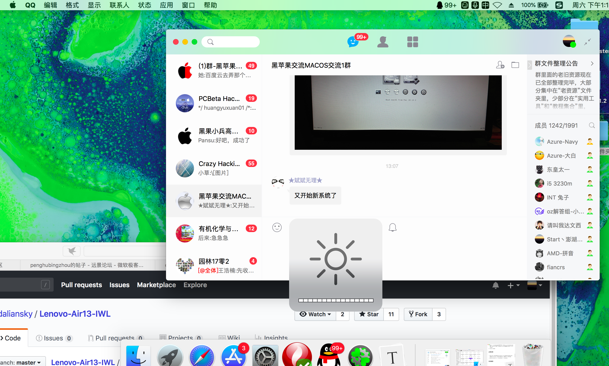
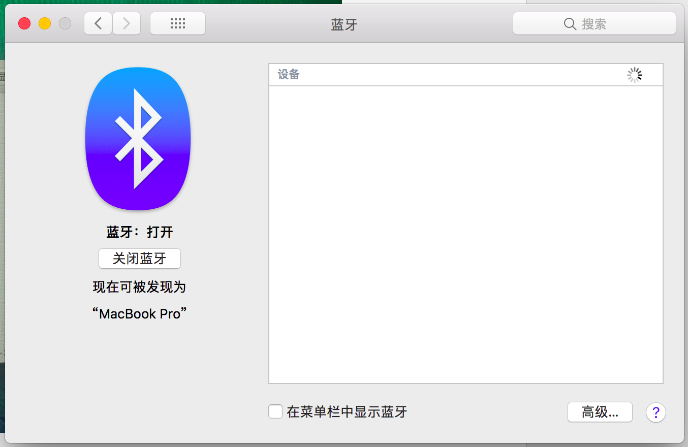
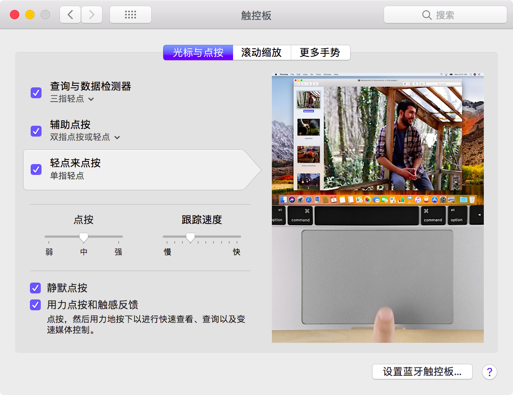

# Lenovo Xiao Xinchao 7000 EFI For Hackinstosh

[中文版](https://github.com/penghubingzhou/Lenovo-Xiaoxin-Chao-7000--EFI/blob/master/Readme.md)|[English](https://github.com/penghubingzhou/Lenovo-Xiaoxin-Chao-7000--EFI/blob/master/docs/Readme.md)

This EFI is suitable for the 7000 14 inch Hackinstosh of Lenovo.

## Computer Configuration

| Specifications | Detail                                                  |
| -------------- | ------------------------------------------------------- |
| Computer model | Lenovo Xiao Xinchao 7000                                |
| Motherboard    | 81BM                                                    |
| Processor      | Intel(R) Core(TM) i5-8250U CPU @ 1.80GHz                |
| Memory         | 8 GB  2400MHz                                           |
| HardDisk       | SAMSUNG MZVLW128HEGR-000L2 128GB+ST1000LM035-1RK172 1TB |
| Graphic Card   | Intel UHD Graphics 620/NVIDIA Graphic 940 MX            |
| Sound Card     | ALC236                                                  |

## Completion of the Situation

1. Graphics Card: due to the limitation of BIOS, it has no solution for DGPU NVIDIA Graphic 940MX and It has been disabled by hotpatch. The core display UHD620 has had native support after  13.6 . It worked with `WhateverGreen`, and the configuration file has already been made framebuffer by `FBPatcher`; HDMI output has some problems at present.
2. NIC: Intel wireless network card has no solution at present, replaced by `DW1560`. The driving way is alternative in Daliansky ‘s blog:  [Broadcom WiFi/BlueTooth BCM94352z(DW1560)的正确驱动姿势[原始方法]](http://blog.daliansky.net/Broadcom-WiFi-BlueTooth-BCM94352z-DW1560-the%20correct-drive-posture.html)
3. Sound Card: The sound card type is `ALC236`, worked with  `AppleALC` . These IDs can work with it  `3, 11, 13, 15, 16, 99` , but only `15, 99` is relatively perfect. This EFI adopted  `99`
4. Bluetooth: Intel Bluetooth has no solution, replace DW1560 Bluetooth , everything is perfect.
5. Battery: Using  `VirtualSMC` and its plugin kext. Battery status worked. 
6. Touchpad:  Using `VoodooI2C` driver, and multitouch gesture is working properly; At present, dragging must be set to three fingers dragging, single finger dragging can not work.
7. Display:  Brightness worked. Use  `F11` and `F12` to control;  HIDPI is available.  [See here to open HIDPI](https://github.com/xzhih/one-key-hidpi)
8. USB port is set by SSDT correctly, and TypeC is available;  Added Virtual built-in network card, USB network card can also use System applications.
9. Camera: 14 Inch series camera has two series: Lingyang (SunplusIT) series, which have  problem in opening FaceTime with camera black at present. The solution is open Photo Booth after open FaceTime to wake-up camera; The other type of camera has no problem.
10. card reader: there is no solution at present.

## Necessary explanation

- At present, there is a serie of this laptop in 14 inches types which is different from this EFI. The specificion of it is that the battery information is not recognized, and the touchpad ID is SYNA2393. This type of laptop in 14 inches can't use this EFI  and it needs to wait for the implement  in next version.
- At present, EFI has not yet supported 13 inches laptop, 13 inches laptop support will come in the next version.
- Because of the need for update, the  `config.plist` for Sierra support is removed and it will no longer be available from version 3.2.

## System Screenshot

## Recently updated

- 12-18-2018  EFI 3.1

  - Update Lilu and WhateverGreen versions.

  - Update Clover to  4798, supported 14.1 and 14.2 now.

  - Use BalckMojave theme.

  - Update VoodooI2C to fix KernelPanic after using long time.

  - Remove the SSDT of variable frequency and use `PluginType` parameter instead.

  - Add virtual built in NIC.

- 10-31-2018  EFI 3.0

  -  Use `CPUfriend` to add CPU frequency data.

  - Add `VoodooSDHC` to drive SD reader.

  - Add `AppleALC` to replace `VoodooHDA`.

- 10-06-2018  EFI 2.1

  - Update the Clover to 4694, use a new theme.
  - `One-key-HIDPI` is added.
  - Drive merge integration.
  - Remove `Shiki`.

## EFI Download:

EFI download is avaliable here,  [Click here to download](https://pan.baidu.com/s/1QcrvxI5a68eUH37RmNd-Fg#list/path=%2F)

## Installation

The image files can obtain in [Daliansky's Blog](https://blog.daliansky.net), or another you want to use.  Of course, if you are good at  Chinese, you can also choose to read my guide of Hard-Disk installation of Hackinstosh and have a try.  [Click here for more details](https://www.penghubingzhou.cn/2019/01/05/教你在Win下Clover硬盘安装黑苹果/) 

## Thanks

- [RehabMan](https://github.com/RehabMan) for  [NullEthernet](https://github.com/RehabMan/OS-X-Null-Ethernet) 、 [USBInjectAll](https://github.com/RehabMan/OS-X-USB-Inject-All)、[VoodooPS2Controller](https://github.com/RehabMan/OS-X-Voodoo-PS2-Controller) and more
- [vit9696](https://github.com/vit9696) for  [Lilu](https://github.com/acidanthera/Lilu) 、 [AppleALC](https://github.com/acidanthera/AppleALC) 、 [WhateverGreen](https://github.com/acidanthera/WhateverGreen) 、 [HibernationFixup](https://github.com/acidanthera/HibernationFixup) and more
- [PMheart](https://github.com/PMheart)  for  [CPUFriend](https://github.com/PMheart/CPUFriend)  and more 
- [Alexandred](https://github.com/alexandred)  and his dev team for [VoodooI2C](https://github.com/alexandred/VoodooI2C)  and more
- [Daliansky](https://github.com/daliansky) for Hackinstosh install image and config update
- **@XianWu** for HotPatch method

## Donate

 If you reckon it good, please support me. Your support is the biggest motivation for me to continue!!!

| WeChat                          | AliPay                          |
| ------------------------------- | ------------------------------- |
|  |  |